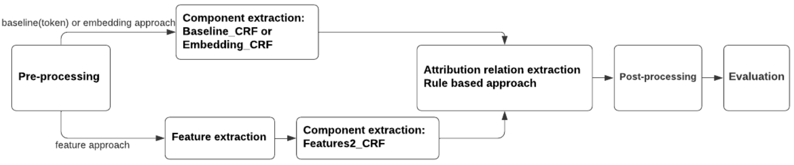
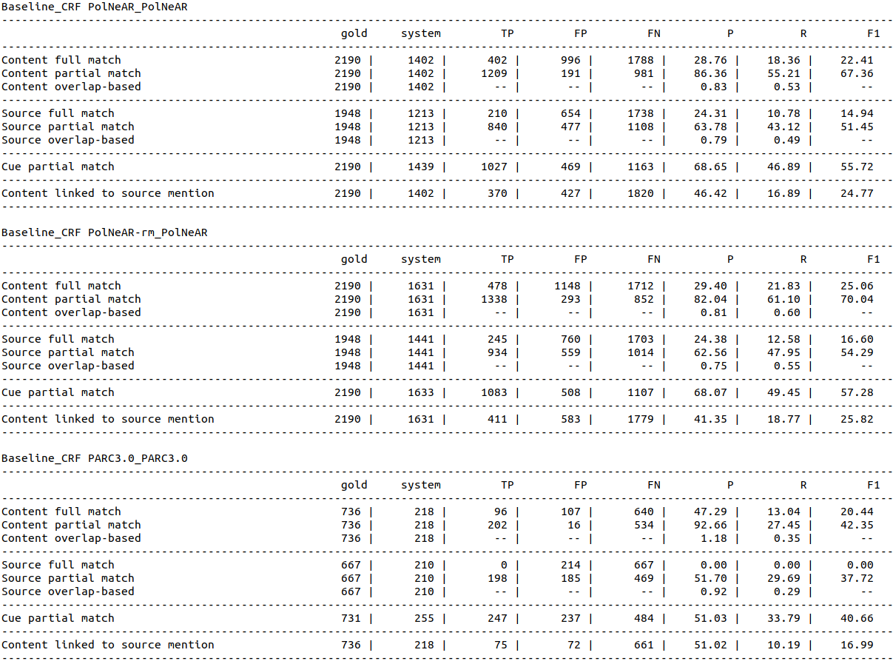
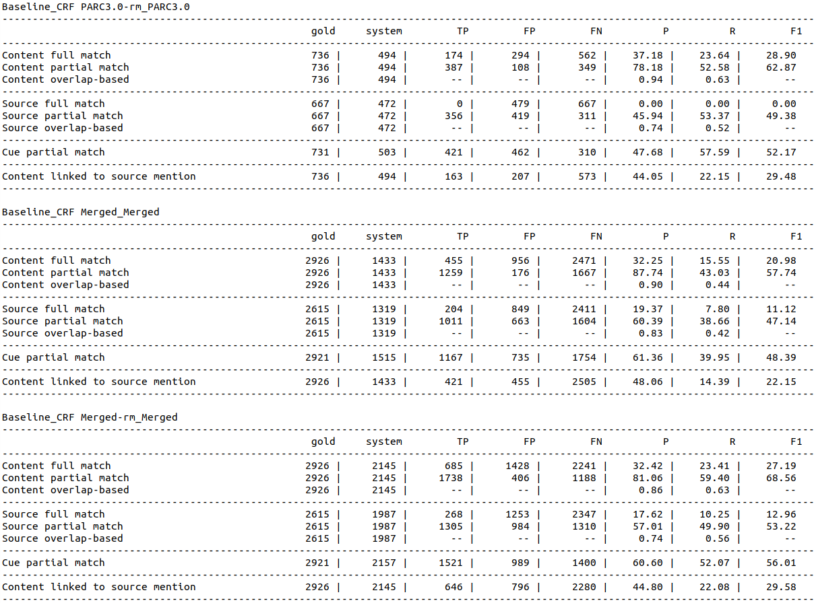
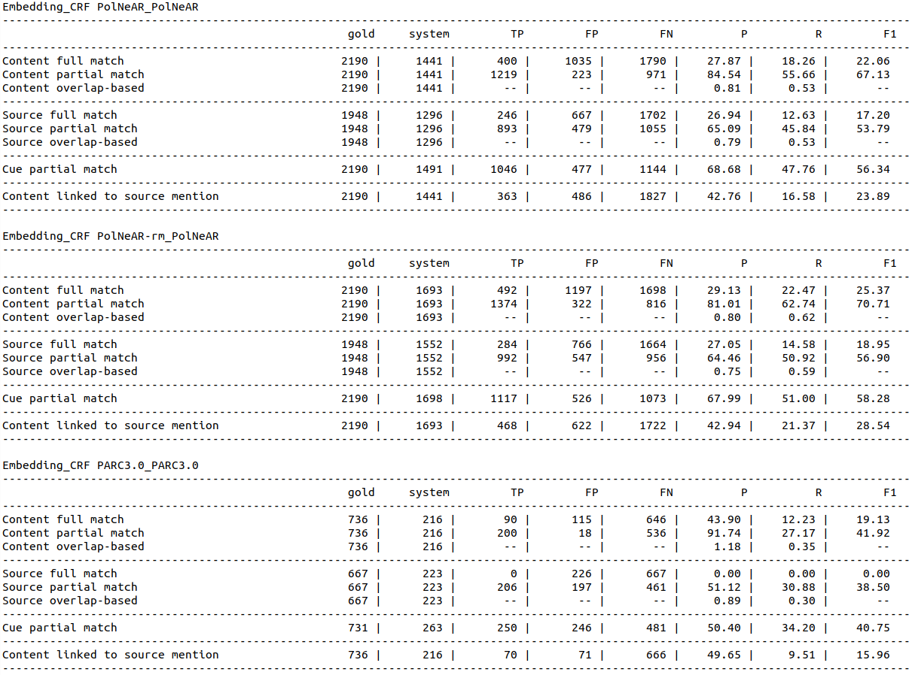
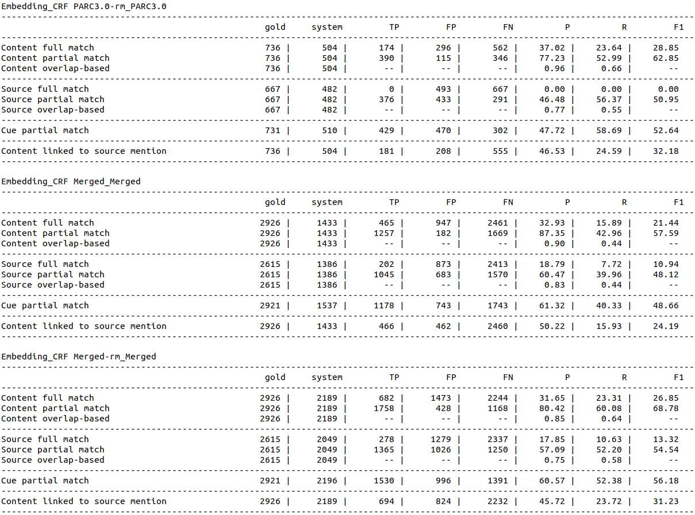
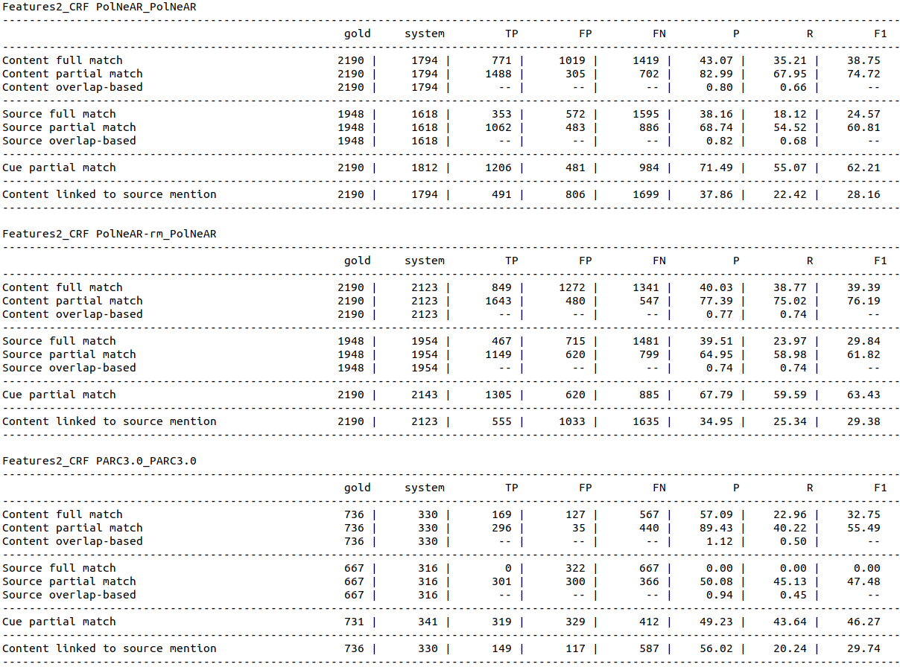
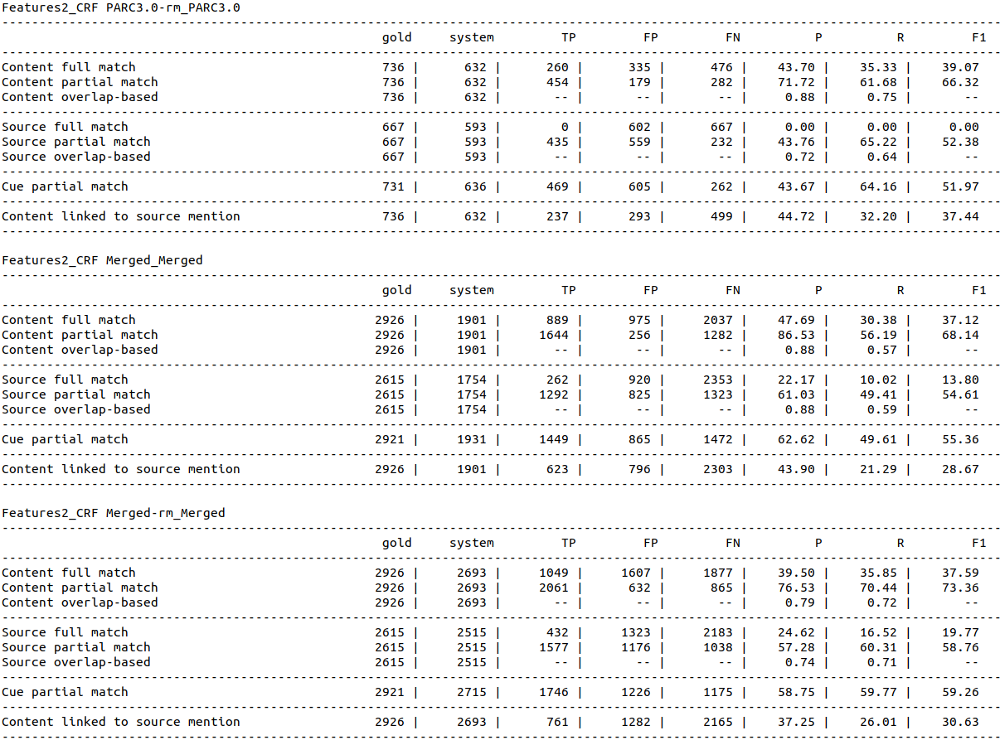

# NLP_Technology(RM)_tutorial_report_Processing_Attribution

This repository contains code and auxiliary materials for NLP Technology(RM) tutorial report **Processing Attribution** by Betty van Dongen (e.c.van.dongen@student.vu.nl), Fina Polat (f.e.yilmazpolat@student.vu.nl) and Xixi Wang (x21.wang@student.vu.nl) in June 2021.

The report **Processing Attribution** introduces a complete pipeline of processing attribution relations (ARs). The pipeline has integrated the Baseline_CRF (the baseline model), Embedding_CRF (the embedding model) and Features2_CRF (the feature model). For the first two models, the pipeline consists of Pre-processing, Component extraction, AR extraction, Post-processing and Evaluation; for the third model, the pipeline includes a Feature extraction before Component extraction.

Through Pre-processing, we can the data set from conll files to 'neat' csv files. The Feature extraction allows more features to be extracted for the use of the feature model. The component extraction is to parallel extract the cues, sources and contents with BIO format. Through AR extraction, we have linked the three components together. Post-processing is to transfer the output of AR extraction into conll files to be prepared for the Evaluation. In the Evaluation process, evaluation.attribution.v5.pl need to be used for the metrics for the full match of sources and contents, and the partial match of sources, contents, cues and ARs.



Although our results aren't comparable with the state-of-the-art performance, yet we've successfully addressed a complete integrated AR pipeline which brings about the possibility of parallel extracting components, and on the other hand, serves as an illustrative reference for similar future work.

The notebooks in this repository are the modules of the pipeline.

## Running the code

All code is in Python 3.

Install requirements:
```bash
pip install -r requirements.txt
```

Usage:

After running through the notebooks from the beginning to the end, the following results should be given:













